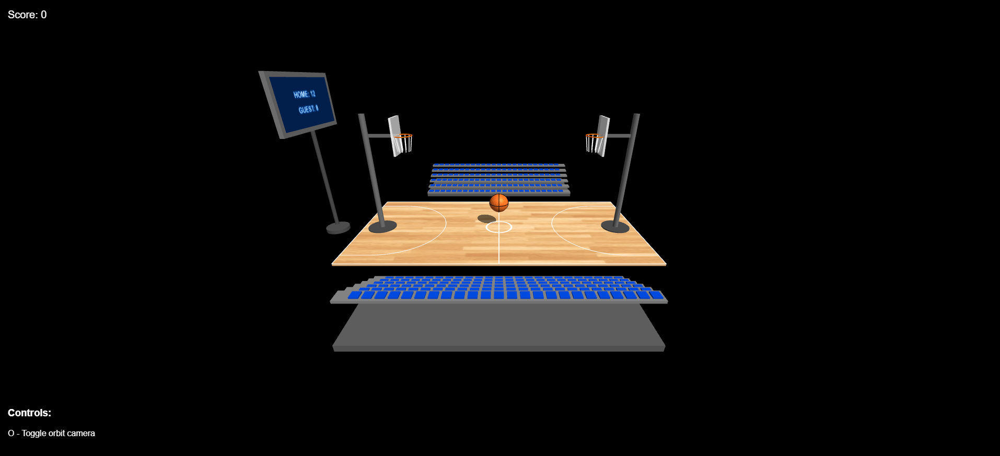
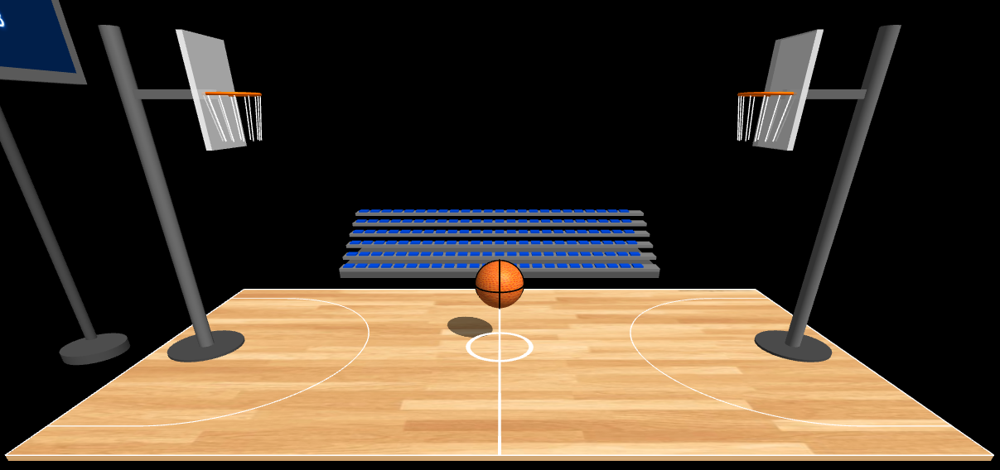

# HW05 – Interactive Basketball Court Infrastructure  
> **Computer Graphics — Spring 2025**

---

## Group Members 

- **Noa Segev**  
- **Yael Shriki**

---

## Project Description

This project implements the full HW05 infrastructure for a 3D interactive basketball court using Three.js and WebGL. It includes a realistic court with center lines and arcs, two regulation-height hoops with support arms and nets, a textured basketball at center court, lighting and orbit controls, and a basic UI setup. It sets the foundation for HW06 (physics and scoring).

---

## How to Run (MANDATORY)

```bash
# Step 1 – Make sure Node.js (v18 or later) is installed

# Step 2 – clone / open the repo then:
cd hw5-basketball-court

# Step 3 – Install dependencies
npm install

# Step 4 – Start the server
node index.js

# Step 5 – Open the project in your browser:
http://localhost:8000
```

---

## Additional Bonus Features

- Textured surfaces for court and basketball
- Simple bleachers and a scoreboard
- More detailed hoop models

---

## Controls

* **O** – toggle orbit controls (pan / zoom / rotate)
* Mouse (when enabled): rotate, right‑drag pan, wheel zoom

---

## Known Issues or Limitations

- No ball physics, movement, or scoring logic — will be added in HW06

---

## External Assets Used

- **Basketball texture**: Free from [Pixabay](https://pixabay.com) (Pixabay License)
- **Court wood texture**: Downloaded from [CC0Textures](https://cc0textures.com) (CC0 License)
- **Three.js & OrbitControls**: From [https://threejs.org](https://threejs.org) (MIT License)

---

## Screenshots 

### 1. Overall View


### 2. Close-Up View


### 4. View Demonstrating Camera Controls Functionality


---

